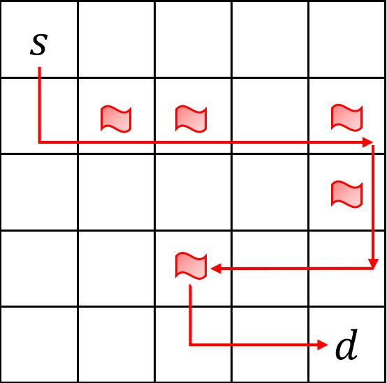

# Knowledge Compilation with RL

Code for the paper [**Integrating Knowledge Compilation with Reinforcement Learning for Routes**](https://ojs.aaai.org/index.php/ICAPS/article/view/16002/15813) published at the 31st [*International Conference on Automated Planning and Scheduling (ICAPS) 2021*](https://icaps21.icaps-conference.org/home/).

***

## Getting Started

### Minimum prerequisites

#### For the training code:

* Python 3 (>=3.6)
* Tensorflow (1.7)
* Numpy (1.13)
* Scipy (1.3)
* Pathos
* [Networkx](https://networkx.org/) (>=2.4)

#### For generating and manipulating SDDs:

* [Graphillion](https://github.com/takemaru/graphillion) 
* [PySDD](https://github.com/wannesm/PySDD)

To install prerequisites in bash 
```
bash install.sh
```
It is recommended to install all the dependencies in a conda environment.

## Running the code

* To start the training process, run
```
cd kcrl/PythonScripts 
python mainKCRL.py -t 500 -b 8 -i 500 -d 0.99 -l 0.001 -z 5x5 -m landmark -n 6 -k 5 -s 0 -x 0 -r 1 -q 25 -f 100 -p 50
```
* Command line flags/options:
  * t: time steps in every training episode;
  * b: batch size (we are using batch traning);
  * i: the number of iterations;
  * d: discount factor;
  * l: learning rate for updating parameters of policy network;
  * z: size of map e.g., 5x5, 10x10;
  * m: type pf map e.g., open, landmark;
  * n: the number of agents in training;
  * k: the number of landmarks (it should be zero if the type of map is open);
  * s: instance ID, each instance has a different configuration e.g., start zones and goal zones for agents;
  * x: run of each instance;
  * r: per time step reward;
  * q: reward for visiting a landmark for the first time;
  * f: final reward for reaching an agent's destination;
  * p: penalty for capacity violation
* All log files (Tensorboard event, model, and agents' paths) will be automatically saved in */PythonScripts/log/* folder after training is done.
  
### Examples

<!--  -->


Consider a 5x5 open grid map with 5 landmarks indicated as flags. Use the default parameters to train the agent for this setting.

To test another setting, you will need to generate your own sdd/psdd and convert the sdd/psdd into intermediate json files using `pypsdd/sdd2json.py` script. 

#### Steps to generate an sdd for an open grid 5x5 map

* Using Graphillion generate sets of all paths i.e. a GraphSet or a zdd (e.g., using ./scripts/grid.py).
* Construct a file that maps sdd variables (literals) to edges (e.g., using ./scripts/grid.py).
* Convert the above generated zdd into sdd using *zdd2sdd* script.
```
python zdd2sdd.py 5x5_icaps.zdd
```
#### Convert sdd/psdd file into intermediate json files
* These intermediate json files are necessary for implementing our fast inference method (TD-SAT) over psdd/sdd during training. 
* These files will be read once we run *DCRL* script
```
python sdd2json.py -f sdd -s 5x5 -m open -n 0
```
* Command line flags/options:
  * f: file type; it takes either sdd or psdd;
  * s: size of map e.g., 5x5, 10x10;
  * m: type pf map e.g., open, landmark;
  * n: the number of landmarks (it should be zero if the type of map is open)
#### Add constraints

* To add constraints (e.g., visiting some landmarks), generate another sdd using PySDD. (Use the script landmarks_constraint.py)
* To combine the main sdd (sdd1) with the constraint sdd (sdd2), conjoin them using the conjoin operation in PySDD. (E.g.,`sdd1.conjoin(sdd2)`)

#### Large Maps

To generate and manipulate decision diagrams for large maps (e.g. 10x10, 20x20), we used hierarchical clustering as defined in the papers [*Tractability in Structured Probability Spaces*](https://proceedings.neurips.cc/paper/2017/file/deb54ffb41e085fd7f69a75b6359c989-Paper.pdf) and [*Structured Bayesian Networks: From Inference to Learning with Routes*](https://ojs.aaai.org//index.php/AAAI/article/view/4796), and implemented in the C++ package [top-down compiler for binary hierarchical map](https://github.com/hahaXD/hierarchical_map_compiler). To [multiply](https://proceedings.neurips.cc/paper/2016/file/5a7f963e5e0504740c3a6b10bb6d4fa5-Paper.pdf) such decision diagrams we used the [PSDD](https://github.com/hahaXD/psdd) C++ package.

* Install the packages: [top-down compiler for binary hierarchical map](https://github.com/hahaXD/hierarchical_map_compiler) and [PSDD](https://github.com/hahaXD/psdd).
  * Use CMakeLists.txt provided in the `scripts` folder to compile the C++ PSDD package.
* Constructing Decision Diagrams:
  * Construct a psdd for a hierarchically clustered map by following the instructions in the [hierarchical map compiler](https://github.com/hahaXD/hierarchical_map_compiler) package. Use `map_network.cpp` provided in the `scripts` folder instead of the one provided in the hierarchical map compiler package (to save a dictionary of edge names and variables which is used later in the training code). Example hierarchical json map files are provided in the `Data` folder.
  * For constraints, construct an sdd using the PySDD package as described above.
* Combine (P)SDDs using the multiplication operation provided in the PSDD C++ package to generate the final decision diagram. (You can use the `scripts/paths_psdd_mult.cpp`).
* Generate the intermediate json files using `pypsdd/sdd2json.py` and use these files to run the training code.